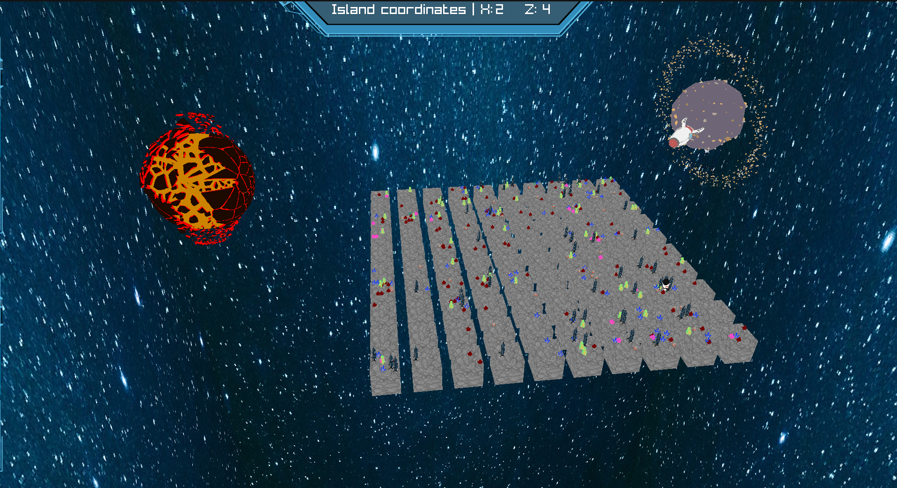

# Introduction

Le Zappy est un projet réalisé par des étudiants d'Epitech qui consiste à développer un jeu en réseau. Dans ce jeu, plusieurs équipes s'affrontent sur un terrain qui contient des ressources. L'équipe gagnante est celle qui parvient à avoir au moins 6 joueurs atteignant le niveau maximal.

 - Le serveur à entièrement été fait en langage [C](https://fr.wikipedia.org/wiki/C_(langage)) avec les librairies du système [Linux](https://fr.wikipedia.org/wiki/Linux)
 - Le Graphique à été fait à l'aide de la [Raylib](https://www.raylib.com/) en [C++](https://fr.wikipedia.org/wiki/C%2B%2B)
 - Les IA ont été développer en [Python3](https://www.python.org/)

# Utilisation

## Lancement du serveur

Après avoir cloné le projet, exécutez la commande **make** pour installer le serveur.

Une fois installé, lancez le serveur avec la commande:

`./zappy_server -p [PORT] -x [WIDTH] -y [HEIGHT] -n [TEAMS] -c [NB_CLIENTS] -f [FREQ]`

- **[PORT]**: Port de connexion vers le serveur.
- **[WIDTH]**: Largeur du terrain.
- **[HEIGHT]**: Hauteur du terrain.
- **[TEAMS]**: Noms des différentes équipes qui pourront s'affronter (séparés par des espaces).
- **[NB_CLIENTS]**: Nombre de joueurs max par équipe.
- **[FREQ]**: Réciproque du temps pour l'exécution d'actions.

## Lancement de l'IA

Pour lancer l'IA, exécutez la commande suivante:

`./zappy_ai -p [PORT] -n [NAME] -h [HOST]`

- **[PORT]**: Port de connexion vers le serveur.
- **[NAME]**: Nom de l'équipe du joueur.
- **[HOST]**: Adresse du serveur sur lequel se connecter.

## Lancement du GUI

Pour lancer le GUI, exécutez la commande suivante:

`./zappy_gui -p [PORT] -h [HOST]`

- **[PORT]**: Port de connexion vers le serveur.
- **[HOST]**: Adresse du serveur sur lequel se connecter.

## Image du Jeu

## Auteurs

- [**Hugo Eschlimann**](https://github.com/HugoEschlimann)
- [**Luca Orelli**](https://github.com/Thorf1nn)
- [**Alexis Arduca**](https://github.com/Alexis-Arduca)
- [**Thibault Bernuz**](https://github.com/Haaycee)
- [**Maxim Costa**](https://github.com/MaximCosta)
- [**Armand Faux**](https://github.com/armandfaux)